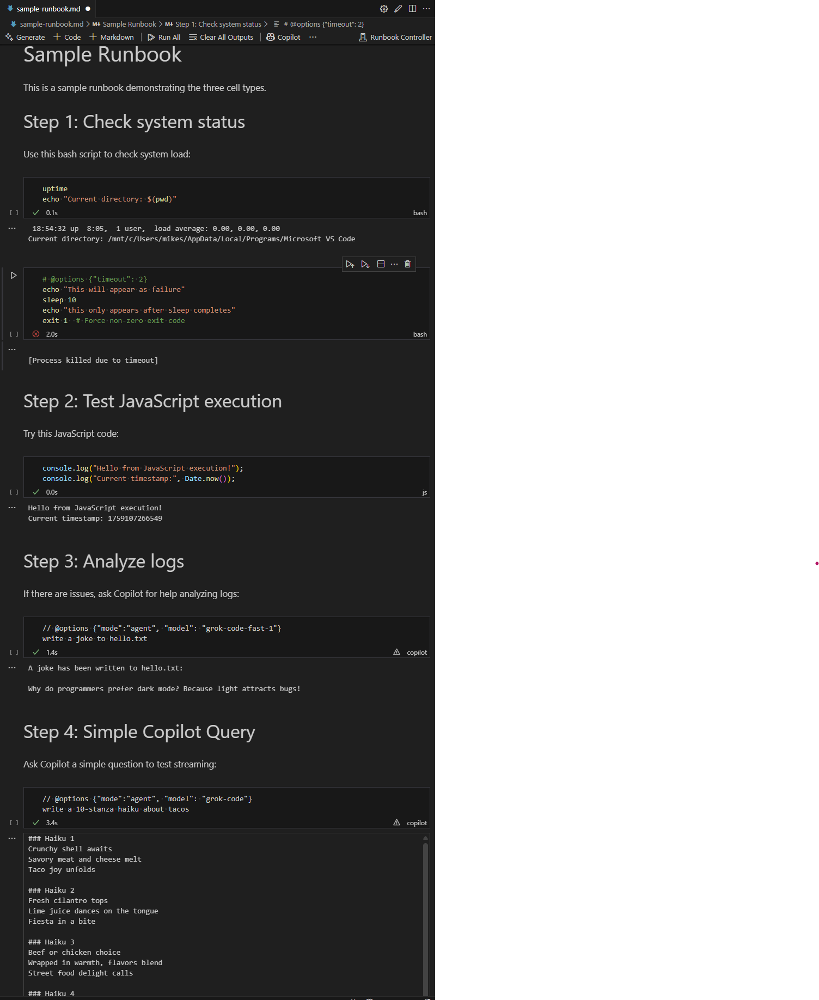
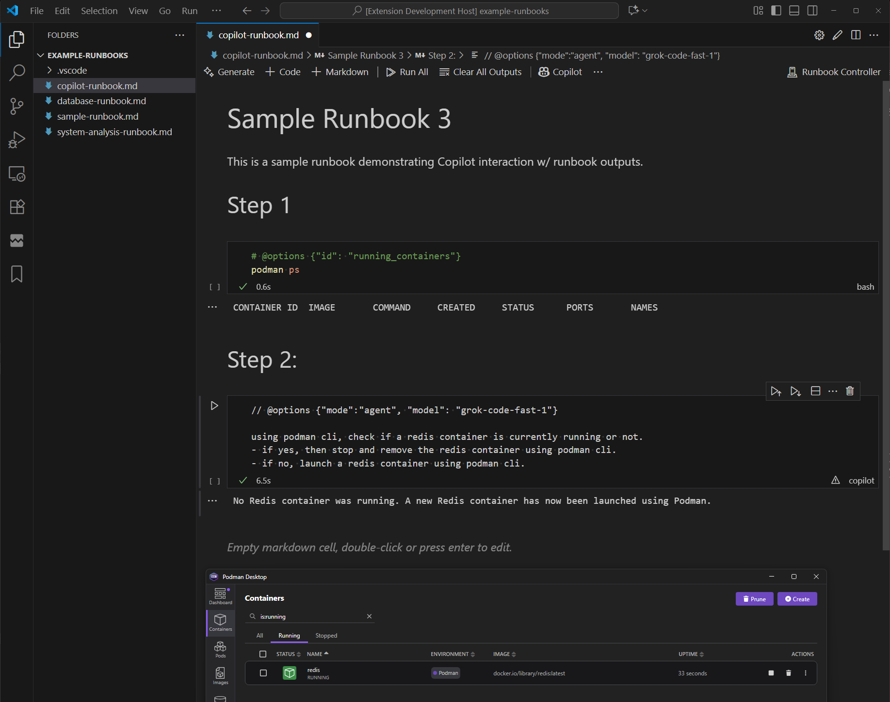

# Runbook Notebook Extension

Provides a Jupyter-like notebook for Runbooks, 
allowing automation of Troubleshooting Guides (TSGs) with:
- 🤖 GitHub Copilot integration
- 🧑🏻‍💻 various scripting languages (Bash, Node.js, Python, etc.)
- 💲 shell execution

## Screenshots





## Features

- **Markdown Cells**: Rendered markdown content for documentation
- **Code Cells (Normal)**: Execute arbitrary code in the terminal
  - Supports JavaScript (Node.js), Python, Bash, and other languages
  - Code is written to a temporary executable file with appropriate interpreters
  - File is executed and stdout/stderr are captured
  - Output appears in the cell's output area (standard notebook behavior)
  - **Rich output rendering**: Outputs containing triple backticks (````) are automatically rendered as markdown
  - **Error handling**: Non-zero exit codes display as error outputs with proper styling
  - **Cancellation support**: Long-running executions can be cancelled (works for all supported languages including Bash, Python, and JavaScript)
- **Copilot Cells**: Send prompts to GitHub Copilot and display responses
  - Copilot response appears in the cell's output area
  - **Cancellation support**: AI requests can be cancelled
  - **Variable Substitution**: Reference outputs from previous cells using `{{variable}}` syntax
  - **File Inclusion**: Include file content using `{{path/to/file.md}}` syntax (reads from workspace root)

## Usage

1. Create a `.md` file for documentation
2. Use code blocks for executable content:
   - ````javascript` for JavaScript code (executed in terminal)
   - ````bash` for shell scripts
   - ````python` for Python code
   - ````copilot` for Copilot prompts
3. (optional) Configure cell behavior using `@options` on the first line with language-appropriate comment syntax:
   - **Copilot cells**: `// @options {"mode": "agent"}` - Enable agent mode with tool access
   - **All code cells**: `# @options {"timeout": 30}` - Set execution timeout in seconds (kills process after timeout)
   - **Variable storage**: `# @options {"id": "variable_name"}` - Store cell output for use in other cells
   - **JavaScript**: `// @options {"node_args": ["--inspect"]}` - Pass Node.js arguments (planned)
   - **Python**: `# @options {"python_path": "/usr/bin/python3"}` - Specify Python interpreter (planned)
   - Both JSON and JavaScript object notation supported: `{"key": "value"}` or `{key: "value"}`
4. Open the file with the Runbook Notebook view
5. Execute cells using the play buttons

### Variable Substitution in Copilot Cells

Two types of variable substitution are supported:

- **Cell Output Variables**: `{{variable_name}}` - References output from cells with `@options {"id": "variable_name"}`
  - Output is wrapped in code blocks: `````markdown\n{output}\n`````
- **File Inclusion**: `{{path/to/file.md}}` - Includes content from files relative to workspace root
  - Content is included as-is without code block wrapping
  - Useful for including documentation, templates, or reference data

## Example Runbooks

- [Sample Runbook](example-runbooks/sample-runbook.md)
- [Copilot Runbook](example-runbooks/copilot-runbook.md)
- [Database Runbook](example-runbooks/database-runbook.md)
- [System Analysis Runbook](example-runbooks/system-analysis-runbook.md)
- [File Inclusion Test](example-runbooks/file-inclusion-test.md) - Demonstrates the new file inclusion feature

## Variable Substitution

Store outputs from code cells and reference them in Copilot prompts using `{{variable}}` syntax:

**How it works:**
- Code cells with `@options {"id": "variable_name"}` store their output
- Copilot cells can reference stored outputs using `{{variable_name}}` syntax
- Variables get replaced with the actual output wrapped in triple backticks

## Installation

1. Clone this repository
2. Run `npm install` in the `runbook-example` folder
3. Press F5 to launch extension development host
4. In the new window, open a `.md` file and use "Open as Notebook" from the toolbar

## Requirements

- VS Code 1.104.2+
- GitHub Copilot extension installed, and active subscription

## Limitations

- Currently supports JavaScript (Node.js), Python, Bash, and shell scripts with appropriate interpreters